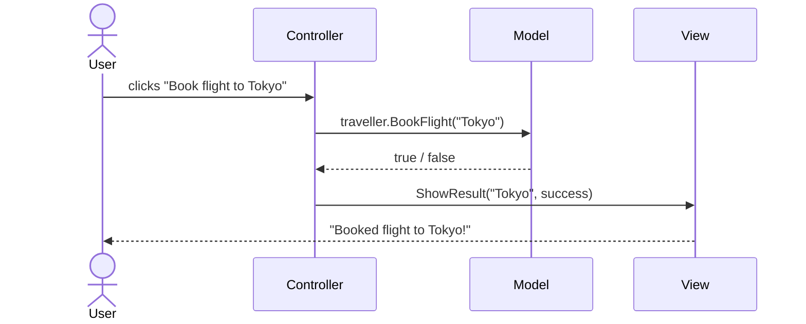

# MVC

MVC (Model-View-Controller) is a design pattern that splits an app into 3 parts, each with **one job** (just like S in SOLID).

---

#### TOC

- [Model](#model)
- [View](#view)
- [Controller](#controller)
- [How they work together](#how-they-work-together)
- [Fat model, thin controller](#fat-model-thin-controller)

---

## Model

The Model is responsible for:

- The **data** and the **business rules** (e.g. "you need 500 points to book a flight").
- It does **not** know anything about the UI. No `Console.WriteLine`, no buttons.

## View

The View is responsible for:

- **Showing** things to the user.
- It does **not** make decisions about the data. It just displays what it's given.

## Controller

The Controller is responsible for:

- Being the **middleman**: take the user's input, ask the Model to do the work, then tell the View what to show.
- It does **not** hold business rules.

|            | Does                                 | Doesn't                    |
| ---------- | ------------------------------------ | -------------------------- |
| Model      | Data + business rules                | Know about the UI          |
| View       | Show stuff to the user               | Make decisions about data  |
| Controller | Take input, call Model, call View    | Hold business rules        |

## How they work together



_Example:_

```csharp
// -------- Model ---------
class Traveller {
    private const int FlightCost = 500;
    private int points;

    public bool BookFlight(string city) {
        if (points < FlightCost) return false;
        points -= FlightCost;
        return true;
    }
}

// -------- View ---------
class TravellerView {
    public void ShowResult(string city, bool success) {
        if (success) Console.WriteLine("Booked flight to " + city + "!");
        else Console.WriteLine("Not enough points.");
    }
}

// -------- Controller ---------
class TravellerController {
    private Traveller traveller;
    private TravellerView view;

    public void Book(string city) {
        bool success = traveller.BookFlight(city); // ask the Model
        view.ShowResult(city, success);            // tell the View
    }
}
```

In the above example, each part sticks to its job. The Model knows the rule (500 points), the View only prints, and the Controller just connects them.

## Fat model, thin controller

> [!IMPORTANT]
> - **Fat model, thin controller**: business logic belongs in the **Model**, and the Controller stays small.
> - The opposite, **fat controller, thin model**, is the bad one. The Model ends up as just data, which is the **anemic model** from OOP.

_Example:_

```csharp
// -------- Good practice (fat model, thin controller) ---------
// Same as the example above: the rule lives inside Traveller.BookFlight()
class TravellerController {
    public void Book(string city) {
        bool success = traveller.BookFlight(city);
        view.ShowResult(city, success);
    }
}

// -------- Bad practice (fat controller, thin model) ---------
class Traveller {
    public int Points { get; set; } // just data, no behaviour
}

class TravellerController {
    public void Book(string city) {
        if (traveller.Points < 500) {                       // business rule
            Console.WriteLine("Not enough points.");        // view's job
            return;
        }
        traveller.Points -= 500;                            // business rule
        Console.WriteLine("Booked flight to " + city + "!"); // view's job
    }
}
```

In the above example, the fat controller is doing the Model's job **and** the View's job. If another feature (e.g. "Change flight") also needs to book, the 500-point rule has to be copied into that controller too. Change the rule later and every copy must be updated. With a fat model, the rule lives in one place and every controller just calls `BookFlight`.
