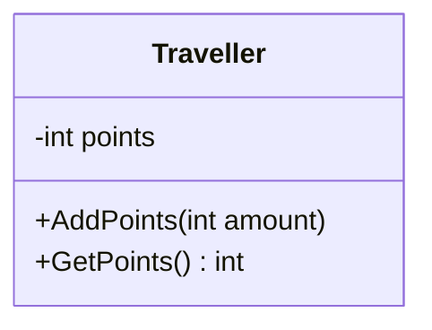
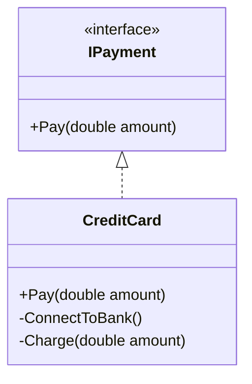
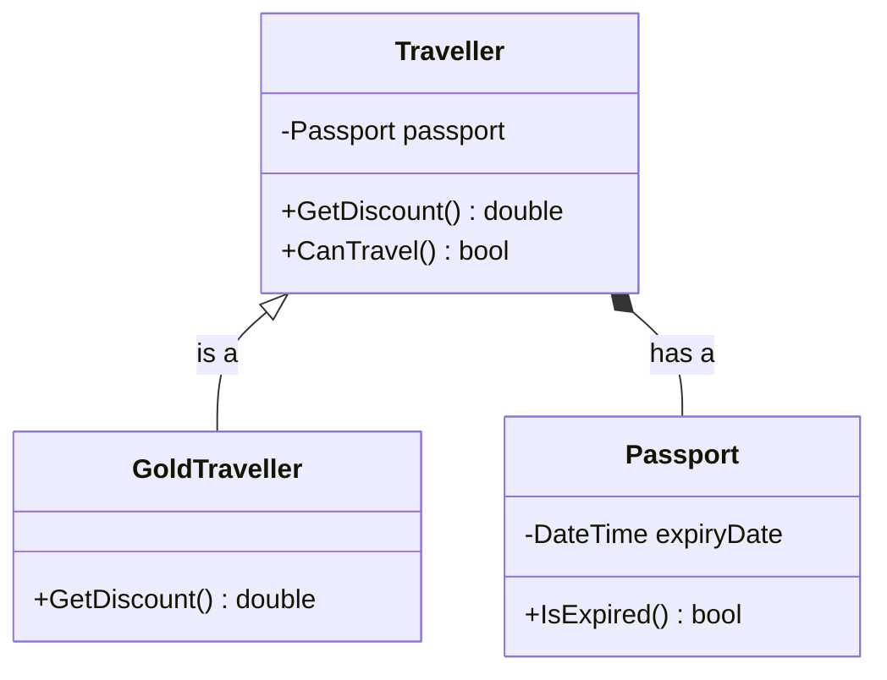
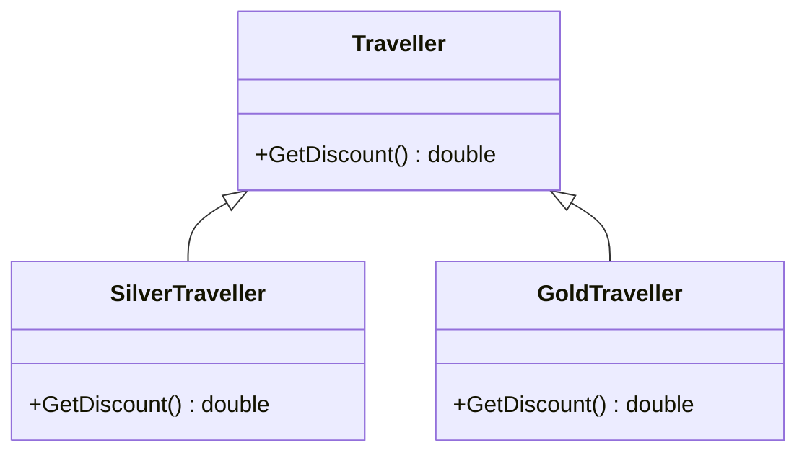

# OOP

OOP (Object-Oriented Programming) is a way of writing code around **objects**: things that hold both **data** (fields) and **behaviour** (methods). It stands on 4 pillars.

---

#### TOC

- [Encapsulation](#encapsulation)
- [Abstraction](#abstraction)
- [Inheritance](#inheritance)
- [Polymorphism](#polymorphism)
- [Anemic model](#anemic-model)

---

## Encapsulation

Encapsulation states that:

- Keep the data **private**, and only let others touch it through **public** methods.
- In other words, a class protects its own data so nobody outside can mess it up.

> [!NOTE]
> It's mostly about `private` / `public` on the **fields and methods** inside a class, not on the class itself.



_`-` means private, `+` means public._

_Example:_

```csharp
// -------- Bad practice ---------
class Traveller {
    public int points;
}

traveller.points = -1000; // nothing stops this
```

```csharp
// -------- Good practice ---------
class Traveller {
    private int points;

    public void AddPoints(int amount) {
        if (amount > 0) points += amount;
    }
    public int GetPoints() {
        return points;
    }
}
```

In the above example, the bad Traveller lets anyone set points to anything. The good Traveller only changes points through AddPoints, which blocks negative values.

## Abstraction

Abstraction states that:

- Show **what** an object does, hide **how** it does it.
- In C#, we do this with an **abstract class** or an **interface**.



_Example:_

```csharp
// -------- Bad practice ---------
class CreditCard {
    public void ConnectToBank() { /* ... */ }
    public void Charge(double amount) { /* ... */ }
}

card.ConnectToBank(); // caller has to know every step, in the right order
card.Charge(100);
```

```csharp
// -------- Good practice ---------
interface IPayment {
    void Pay(double amount);
}

class CreditCard : IPayment {
    public void Pay(double amount) {
        ConnectToBank();
        Charge(amount);
    }
    private void ConnectToBank() { /* lots of messy bank code */ }
    private void Charge(double amount) { /* more messy code */ }
}

IPayment payment = new CreditCard();
payment.Pay(100); // caller only sees Pay()
```

In the above example, the bad version pushes all the details onto the caller. The caller of the good version just calls Pay and doesn't care how it works inside.

**Abstract class vs Interface:**

|                       | Abstract class               | Interface                        |
| --------------------- | ---------------------------- | -------------------------------- |
| Can contain real code | Yes                          | Mostly just method signatures    |
| How many can I use    | Only 1 parent                | As many as you want              |
| Use when              | Child classes share code     | Unrelated classes share a skill  |

## Inheritance

Inheritance states that:

- A **child** class gets everything from its **parent** class, and can add or change things. This is an **"is-a"** relationship.
- But reusing code doesn't always need inheritance. **Composition** means a class **has** another class inside it. This is a **"has-a"** relationship.

> [!TIP]
> Rule of thumb: **is-a → inheritance, has-a → composition**. When unsure, pick composition (see L in SOLID, the Penguin problem).



_Example:_

```csharp
// -------- Bad practice ---------
class Traveller : Passport { } // a Traveller is NOT a Passport
```

```csharp
// -------- Good practice: Inheritance (is-a) ---------
class Traveller {
    public virtual double GetDiscount() {
        return 0;
    }
}

class GoldTraveller : Traveller {
    public override double GetDiscount() {
        return 0.2; // 20% off
    }
}
```

```csharp
// -------- Good practice: Composition (has-a) ---------
class Passport {
    private DateTime expiryDate;
    public bool IsExpired() {
        return expiryDate < DateTime.Now;
    }
}

class Traveller {
    private Passport passport; // Traveller HAS a Passport
    public bool CanTravel() {
        return !passport.IsExpired();
    }
}
```

In the above example, a Traveller is **not** a Passport, so inheriting from it is wrong. A GoldTraveller **is a** Traveller, so inheritance fits. A Traveller just **has a** Passport, so it keeps one inside instead.

## Polymorphism

Polymorphism states that:

- A child object can be treated as its **parent** type.
- In other words, the same method call behaves differently depending on the actual object. ("Poly" = many, "morph" = forms.)



_Example:_

```csharp
class SilverTraveller : Traveller {
    public override double GetDiscount() {
        return 0.1;
    }
}

// A List<Traveller> can also hold Silver and Gold Travellers
List<Traveller> travellers = new List<Traveller> {
    new Traveller(),
    new SilverTraveller(),
    new GoldTraveller()
};
```

```csharp
// -------- Bad practice ---------
foreach (Traveller t in travellers) {
    if (t is GoldTraveller) Console.WriteLine(0.2);
    else if (t is SilverTraveller) Console.WriteLine(0.1);
    else Console.WriteLine(0);
}
```

```csharp
// -------- Good practice ---------
foreach (Traveller t in travellers) {
    Console.WriteLine(t.GetDiscount()); // 0, 0.1, 0.2
}
```

In the above example, the bad loop checks types by hand, so adding a PlatinumTraveller means editing every if-chain (breaks O in SOLID). The good loop just calls GetDiscount and each object answers for itself.

## Anemic model

An anemic model is:

- A class that only has **data** (fields/properties) and **no methods**. All the logic lives somewhere else.
- A class should have **behaviour**. If it only holds data, it's just a data bag (basically a struct), not a real object.

_Example:_

```csharp
// -------- Bad practice (anemic model) ---------
class Traveller {
    public int Points { get; set; }
}

class TravellerService {
    public void AddPoints(Traveller t, int amount) {
        if (amount > 0) t.Points += amount;
    }
}

traveller.Points = -1000; // skips the service, nothing stops this
```

```csharp
// -------- Good practice (rich model) ---------
class Traveller {
    private int points;
    public void AddPoints(int amount) {
        if (amount > 0) points += amount;
    }
}
```

In the above example, the anemic Traveller is just data, so the rules sit in another class and anyone can skip them. This also breaks encapsulation. The rich Traveller owns its data **and** the rules for it.
