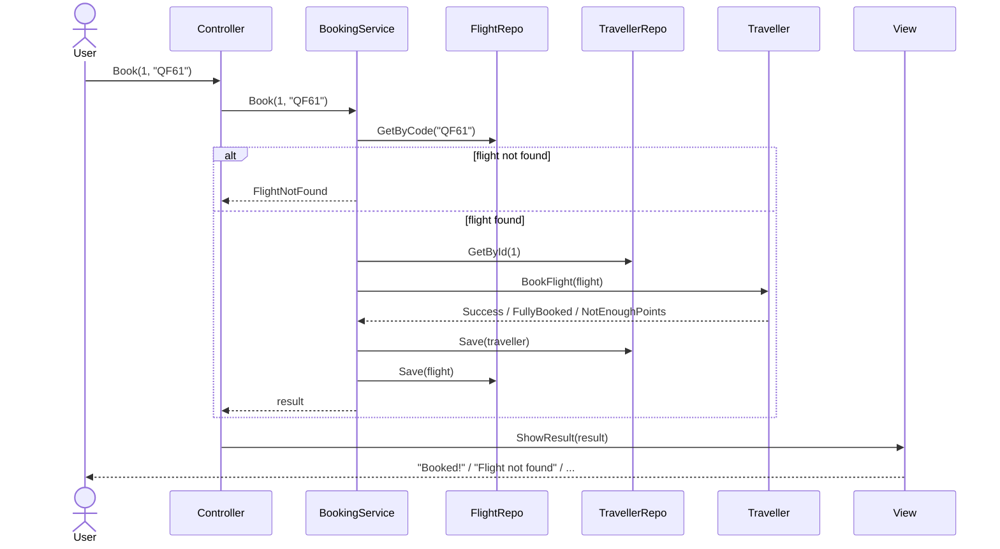

# Scenario: In-memory DB now, relational DB later

A worked example that uses [OOP](OOP.md), [SOLID](SOLID.md) and [MVC](MVC.md) together. Read those first.

---

#### TOC

- [The problem](#the-problem)
- [Step 1: Repository, one small interface per type](#step-1-repository-one-small-interface-per-type)
- [Step 2: The Model gets the data, not the DB](#step-2-the-model-gets-the-data-not-the-db)
- [Step 3: A Service does load → decide → save](#step-3-a-service-does-load--decide--save)
- [Step 4: Wire everything up in Main (DI)](#step-4-wire-everything-up-in-main-di)
- [Checklist](#checklist)

---

## The problem

A common assignment brief looks like this:

> _"Use an in-memory DB for now. Later in the semester, switch to a relational DB."_

And the feature we need is **booking a flight**:

- The flight code must **exist** in the DB.
- The flight must have **seats left**.
- The traveller must have **enough points**.
- If everything is OK, take the points, take a seat, and **save** both.

### The naive way

The first thing most people write: one global DB class, and the controller does everything.

```csharp
// -------- Bad practice ---------
class InMemoryDB {
    public static List<Traveller> Travellers = new List<Traveller>();
    public static List<Flight> Flights = new List<Flight>();
}

class Traveller {
    public int Id { get; set; }
    public int Points { get; set; }
}

class Flight {
    public string Code { get; set; }
    public int Cost { get; set; }
    public int SeatsLeft { get; set; }
}

class TravellerController {
    public void Book(int travellerId, string flightCode) {
        Flight flight = InMemoryDB.Flights.Find(f => f.Code == flightCode);
        if (flight == null) { Console.WriteLine("Flight not found."); return; }
        if (flight.SeatsLeft <= 0) { Console.WriteLine("Flight is full."); return; }

        Traveller traveller = InMemoryDB.Travellers.Find(t => t.Id == travellerId);
        if (traveller.Points < flight.Cost) { Console.WriteLine("Not enough points."); return; }

        traveller.Points -= flight.Cost;
        flight.SeatsLeft--;
        Console.WriteLine("Booked " + flightCode + "!");
    }
}
```

It works, so what's the problem?

### What goes wrong

| When...                         | What happens                                                                                              |
| ------------------------------- | --------------------------------------------------------------------------------------------------------- |
| We switch to the relational DB  | Every line that says `InMemoryDB` has to be rewritten, in **every** controller                            |
| We read the controller          | It does the DB's job, the Model's job (rules) **and** the View's job (printing). That's a **fat controller** |
| We look at Traveller and Flight | Just data, no behaviour. That's the **anemic model**, and anyone can set `Points = -1000`                 |
| We want to test the booking rules | We can't without filling a real DB first, because the rules are tangled with storage                    |
| Another feature (e.g. "Change flight") needs the same checks | The rules get copied into that controller too. Change a rule later and every copy must be updated, miss one = bug |

### The tempting fix (also wrong)

"Fine, let's move the logic into the Model". But BookFlight needs to check the DB, so the Model gets a DB attribute:

```csharp
// -------- Bad practice ---------
class Traveller {
    private IDB db; // every Traveller now carries a DB around
    // ...
}
```

This feels weird, and it is. The Traveller now has 2 jobs (rules **and** storage), which breaks S in SOLID. It also breaks MVC, where the Model should know nothing about storage.

### The questions

So we need answers to:

- **Who holds the DB?** Not the Model. A **repository** handles storage. For a simple action the Controller can use it directly, but booking touches 2 repositories, so a **service** uses them instead ([Step 1](#step-1-repository-one-small-interface-per-type), [Step 3](#step-3-a-service-does-load--decide--save)).
- **So how does the Model check the DB?** It doesn't. Someone else **loads** the data first, then **passes** it to the Model so the Model can decide ([Step 2](#step-2-the-model-gets-the-data-not-the-db)).
- **How do we switch DBs without rewriting everything?** Everyone depends on an **interface**, and the real DB is plugged in once in Main ([Step 4](#step-4-wire-everything-up-in-main-di)).

> [!IMPORTANT]
> The Model never touches the DB: **load → let the Model decide → save**.

## Step 1: Repository, one small interface per type

A **repository** is a class whose only job is to load and save one type of object.

```csharp
interface ITravellerRepository {
    Traveller GetById(int id);
    void Save(Traveller traveller);
}

interface IFlightRepository {
    Flight GetByCode(string code); // null if not found
    void Save(Flight flight);
}

// -------- Now ---------
class InMemoryFlightRepository : IFlightRepository {
    private Dictionary<string, Flight> flights = new Dictionary<string, Flight>();

    public Flight GetByCode(string code) { return flights.GetValueOrDefault(code); }
    public void Save(Flight flight) { flights[flight.Code] = flight; }
}

// -------- Later ---------
class SqlFlightRepository : IFlightRepository {
    public Flight GetByCode(string code) { /* SELECT ... */ }
    public void Save(Flight flight) { /* UPDATE ... */ }
}
```

The same goes for `InMemoryTravellerRepository` and `SqlTravellerRepository`.

## Step 2: The Model gets the data, not the DB

```csharp
enum BookingResult { Success, FlightNotFound, FullyBooked, NotEnoughPoints }

class Flight {
    public string Code { get; }
    public int Cost { get; }
    private int seatsLeft;

    public Flight(string code, int cost, int seats) {
        Code = code; Cost = cost; seatsLeft = seats;
    }
    public bool HasSeats() { return seatsLeft > 0; }
    public void TakeSeat() { seatsLeft--; }
}

// -------- Good practice ---------
class Traveller {
    public int Id { get; }
    private int points;

    public BookingResult BookFlight(Flight flight) { // gets a Flight, not a DB
        if (!flight.HasSeats()) return BookingResult.FullyBooked;
        if (points < flight.Cost) return BookingResult.NotEnoughPoints;
        points -= flight.Cost;
        flight.TakeSeat();
        return BookingResult.Success;
    }
}

// -------- Bad practice ---------
class Traveller {
    private IFlightRepository flights; // Model now depends on storage

    public bool BookFlight(string code) {
        Flight flight = flights.GetByCode(code);
        // ...
    }
}
```

In the above example, the good Traveller still owns all the booking rules (fat model), but it doesn't know a DB exists. That also makes it easy to test: just pass in a `new Flight(...)`.

## Step 3: A Service does load → decide → save

The booking now involves **2 repositories and 2 models**. That's too much for a thin controller, so we add a **Service** in the middle.



```csharp
class BookingService {
    private ITravellerRepository travellers;
    private IFlightRepository flights;

    public BookingService(ITravellerRepository travellers, IFlightRepository flights) {
        this.travellers = travellers;
        this.flights = flights;
    }

    public BookingResult Book(int travellerId, string flightCode) {
        Flight flight = flights.GetByCode(flightCode);          // 1. load (DB check)
        if (flight == null) return BookingResult.FlightNotFound;

        Traveller traveller = travellers.GetById(travellerId);
        BookingResult result = traveller.BookFlight(flight);    // 2. Model decides

        if (result == BookingResult.Success) {                  // 3. save
            travellers.Save(traveller);
            flights.Save(flight);
        }
        return result;
    }
}

// -------- Controller: still thin ---------
class TravellerController {
    private BookingService bookingService;
    private TravellerView view;

    public TravellerController(BookingService bookingService, TravellerView view) {
        this.bookingService = bookingService;
        this.view = view;
    }

    public void Book(int travellerId, string flightCode) {
        BookingResult result = bookingService.Book(travellerId, flightCode);
        view.ShowResult(flightCode, result);
    }
}

// -------- View: turns the result into text ---------
class TravellerView {
    public void ShowResult(string flightCode, BookingResult result) {
        switch (result) {
            case BookingResult.Success:         Console.WriteLine("Booked " + flightCode + "!"); break;
            case BookingResult.FlightNotFound:  Console.WriteLine("Flight not found."); break;
            case BookingResult.FullyBooked:     Console.WriteLine("Flight is full."); break;
            case BookingResult.NotEnoughPoints: Console.WriteLine("Not enough points."); break;
        }
    }
}
```

## Step 4: Wire everything up in Main (DI)

```csharp
ITravellerRepository travellers = new InMemoryTravellerRepository();
IFlightRepository flights = new InMemoryFlightRepository();
// later: new SqlTravellerRepository(...), new SqlFlightRepository(...)

BookingService bookingService = new BookingService(travellers, flights);
TravellerController controller = new TravellerController(bookingService, new TravellerView());

controller.Book(1, "QF61");
```

> [!TIP]
> Switching to the relational DB means changing **only these 2 lines**. No Model, Service, Controller or View code changes.

## Checklist

| Principle   | Where                                                                                      |
| ----------- | ------------------------------------------------------------------------------------------ |
| **S**       | Model = rules, Repository = storage, Service = steps, Controller = connect, View = display |
| **O**       | Add `SqlFlightRepository` without modifying any existing class                             |
| **L**       | In-memory and SQL repositories can replace each other freely                               |
| **I**       | Small `ITravellerRepository` / `IFlightRepository`, not one giant `IDB`                    |
| **D**       | Service depends on repository **interfaces**, and Main injects the real ones              |
| **MVC**     | Model has no UI and no DB. Controller stays thin                                           |
| **OOP**     | Abstraction: nobody above the repository knows if it's in-memory or SQL                    |
